# Интернет магазин косметики Виртуаль
### 1) Цель работы
Улучшить пользовательский опыт в заказе товаров из интернет магазина, достичь это посредством выявления и использования всех удобных решений предоставленных существующими интернет магазинами.

### 2) Краткий перечень функциональных требований 

Для достижения цели были выявлены следующие функциональные требования.
1) Для пользователя
- Возможность поиска товара по артикулу или названию без авторизации.
- Возможность просмотра товаров в каталоге по категории или по названию бренда без авторизации.
- Возможность добавлять или удалять отзыв на товар только с авторизацией.
- Возможность просмотра отзывов на товар без авторизации.
- Возможность положить товар в корзину или в избранное только при условии авторизации, а также удалять товары из избранного или корзины и менять количество товара в корзине.
- Возможность сделать заказ.
2) Для работника склада
<!-- - Возможность посмотреть не взятые заказы. -->
<!-- - Возможность принять заказ. -->
- Возможность менять статус заказа. 
3) Для администратора
- Взаимодействовать с каталогом товаров: удалять товар из каталога и добавлять товар в каталог.
- Добавлять информацию о работниках или удалять эту информацию.

### 3) Use-Case - диаграмма

### 4) Формализация ключевых бизнес-процессов

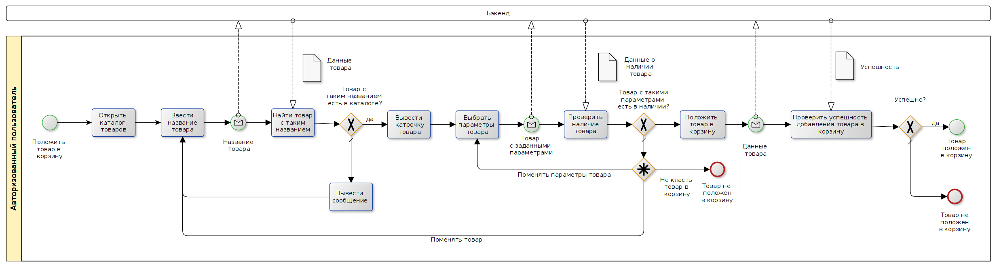
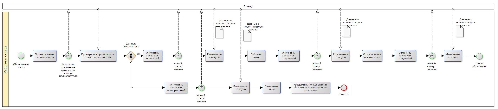
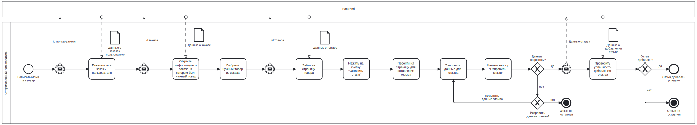

### 5) ER-диаграмма сущностей

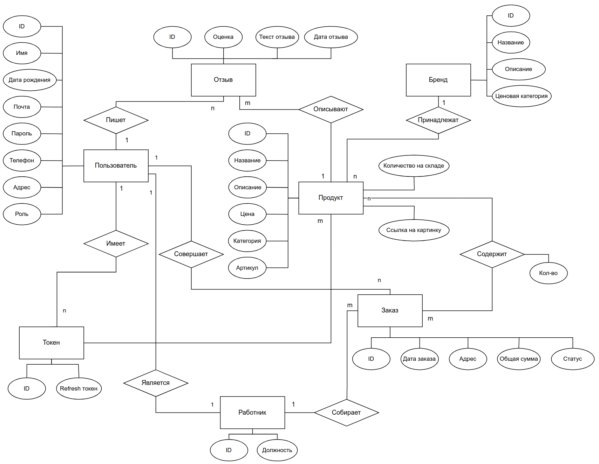

### 6) Технологический стек

1) Тип приложения: Web SPA
2) Backend: Golang
3) Frontend: React
4) СУБД: PostgreSQL

### 7) Диаграмма базы данных

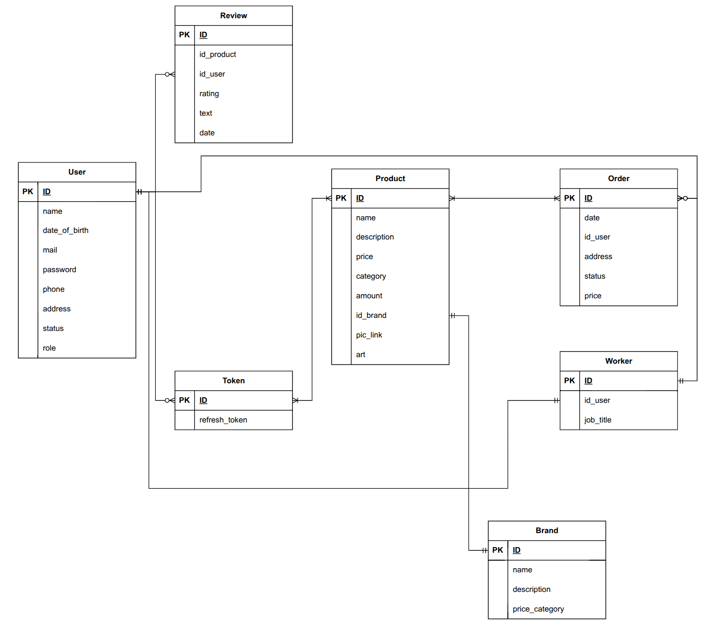

### 8) Компонентная диаграмма системы

### 9) Экраны будущего web-приложения на уровне черновых эскизов
Главный экран, каталог товаров

Карточка товара
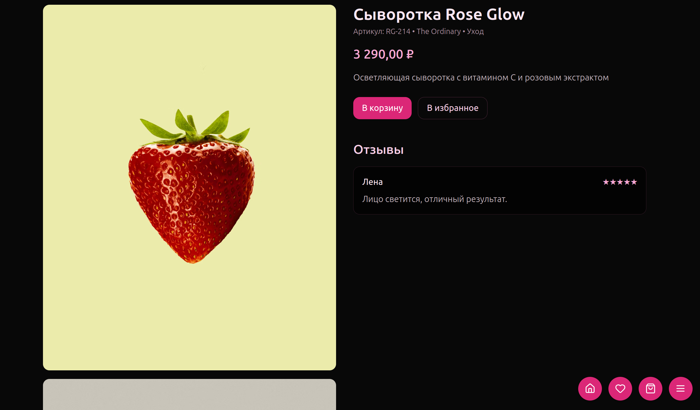
Избранное
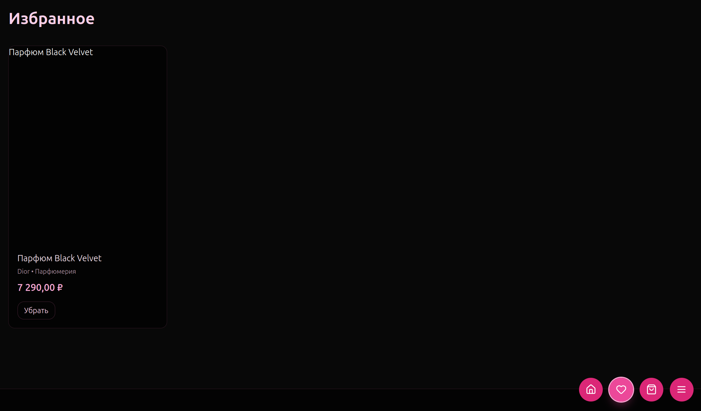
Вход в приложение
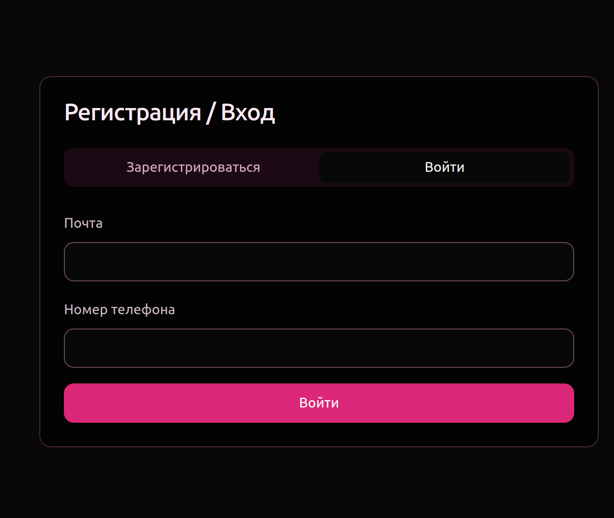
Регистрация пользователя
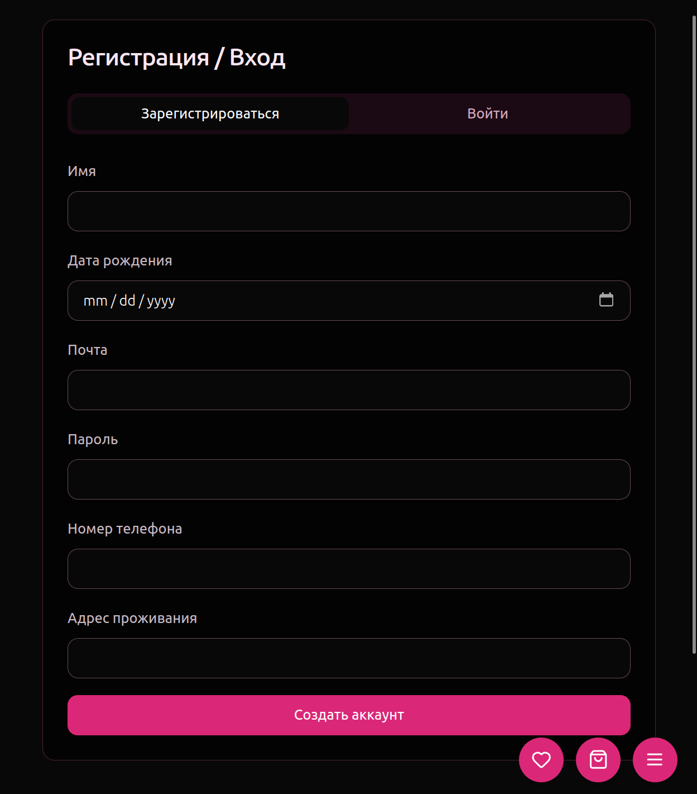
Экран работника
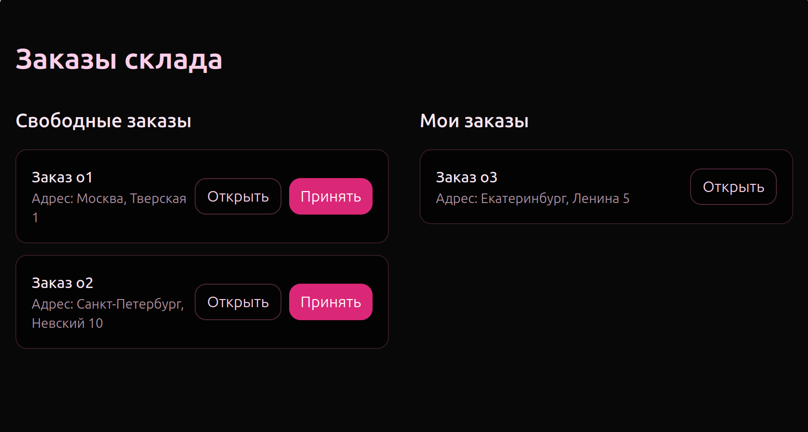
Экран админа
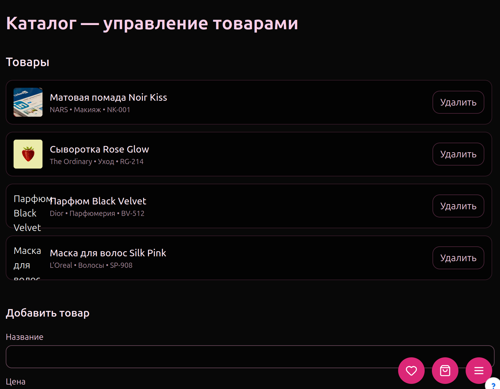
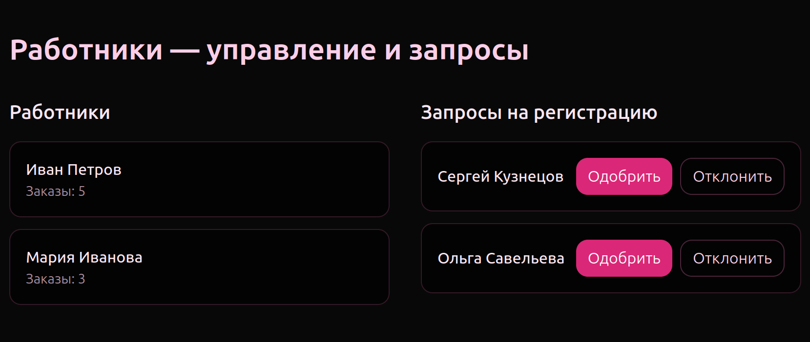

<!-- ### 2) Краткое описание идеи проекта
Web-приложение для интернет мегазина косметики. В приложении будет представлен каталог товаров, которые можно положить в корзину, а затем заказать. Далее заказ собирается на складе и покупатель может получить его со склада.

### 3) Краткое описание предметной области
Web-приложение предназначенное для покупки косметических товаров. Заказ совершается на сайте, собирается на складе и отправляется покупателю.

### 4) Краткий анализ аналогичных решений
| Магазин          | Отзывы       | Скидки при заказе   большого количества   одного товара | Система   лояльности | Поиск по   артикулу |
|------------------|--------------:|---------------------------------------------------------------:|-------------------------:|------------------------:|
| Золотое яблоко   |       -       |                               -                                |             +            |           +             |
| Рив Гош          |       +       |                               -                                |             +            |           -             |
| Иль-де-Ботэ      |       -       |                               -                                |             +            |           -             |
| Лэтуаль          |       +       |                               -                                |             +            |           +             |
| Виртуаль         |       +       |                               +                                |             +            |           +             |

### 5) Краткое обоснование целесообразности и актуальности проекта
Данный проект является актуальным, потому что растет спрос на косметические товары. В поиске выгоды и скидок люди просматривают больше варинтов. Чем больше вариантов приобретения товара будет предложено человеку, тем легче ему будет выбрать лучший для себя вариант. Также с увеличением количества магазинов косметики, увеличивается доступность товара для покупателя. 

### 6) Роли:
1. Пользователь может быть:
    * Авторизованный
    * Неавторизованный
  
    Неавторизованный пользователь может зарегистрироваться, авторизоваться, искать товар, смотреть на него отзывы.
    У авторизованного пользователя есть все возможности неавторизованного, но еще он может класть товары в корзину и оформлять заказ, а также оставлять отзывы на купленный товар.
2. Администратор занимается редактированием товаров и отзывов.
3. Работник склада собирает заказы и корректирует их количество в каталоге.

### 7) Use-Case - диаграмма

### 8) ER-диаграмма сущностей

### 9) Пользовательские сценарии
1. Пользователь хочет сделать заказ. Для этого:
   1. Зайти в каталог товаров
   2. Найти товар
   3. Указать количество товара
   4. Положить в корзину
   5. Перейти в корзину
   6. Оформить заказ
   7. Оплатить заказ
   
2. Работник склада хочет обработать заказ. Для этого:
    1. Просмотреть список непринятых заказов 
    2. Принять заказ
    3. Собрать заказ
    4. Отметить новый статус заказа
    5. Отдать заказ
    6. Отметить новый статус заказа 
   
3. Пользователь хочет написать отзыв на товар. Для этого:
   1. В списке заказанных товаров выбрать товар
   2. Зайти на страницу товара и перейти в раздел отзывы
   3. Написать текст отзыва и поставить оценку
   4. Отправить отзыв на проверку

4. Администратор хочет проверить отзыв. Для этого:
   1. Открыть страницу с отзывами, отправленными на модерацию
   2. Выбрать отзыв
   3. Проверить корректность отзыва
   4. Пропустить отзыв или отказать в публиковании

5.  Работник склада хочет принять поставку. Для этого:
    1. Принять товар
    2. Редактировать количество товара 
    3. Отправить сообщение о получении товара

6. Администратор хочет подтвердить принятие товара. Для этого:
   1. Заходит на страницу с уведомлениями от склада
   2. Выбрать увердомление
   3. Обновить данные о товаре на сайте

### 10) Формализация ключевых бизнес-процессов

## ЛР2

### 11) Технологический стек
1) Тип приложения: Web SPA
2) Backend: Golang
3) Frontend: React
4) СУБД: PostgreSQL

### 12) Верхнеуровневое разбиение на компоненты

### 13) Диаграмма разбиения на классы

Страница регистрации/аутентификации
На этой странице должен быть выбор зарегистрироваться/войти, при выборе зарегистрироваться у пользователя должна быть возможность ввести такие данные: имя, дата рождения, почта, пароль, номер телефона, адресс проживания, при выборе войти, пользователь должен ввести почту и номер телефона. Черный фон, а рамки у полей ввода должны быть неярко розовые
Страница товаров
На этой странице должны показываться товары, как каталог, как решетка, в которой отображены картинки товаров, цены товаров, их краткая характеристика, при наведении на товар должна появляться возможность посмотреть фотки товара. Страница товаров базовая, на нее можно зайти без авторизации. Она должна опять в черно-розовых цветах, можно добавить какие-то смежные цвета чтобы разнообразить по-желанию.
Страница личного кабинета
Тут должна отображаться информация пользователя: Его имя, почта, номер телефона, адрес, должна быть кнопка, при нажатии на которую будет возможность показать список всех сделанных этим пользователем заказов, при нажатии на заказы можно получить список всех товаров в этом заказе, при нажатии на товар переходишь на страницу этого товара. Опять все в черно-розовых цветах
Иконки корзины и избранного должны присутствовать на экране всегда, рядом с тремя линиями, которые будут изображать меню там такие пункты: Личный кабинет, Бренды, Категории. При наведении на Бренды должен появляться список брендов, при наведении на категории должен появляться список категорий. При нажатии на Личный кабинет, если человек авторизован должно перекидывать на страниуцу личного кабинета, а если пользователь не авторизован, должно перебрасывать на страницу авторизации. Это будут три маленькие иконки в правом нижнем углу. При нажатии на три линии будет показываться меню, которое описано выше, при нажатии на корзину, будет перебрасывать на страницу корзины, а при нажатии на избранное(оно должно быть обозначено сердечком) будет перекидывать на страницу избранного. Страница избранного выглядит как страница товаров, а на странице корзины товара товары расположены в прямоугольных рамочках друг под другом, в каждой рамочке фото товара, краткая информация о нем, а также справа этой рамочки -, колво товара и +, при нажатии на -, при количестве товара 1, товар удаляется из корзины (с этой страницы) при нажатии на - в случае количества товара больше одного, просто именяется количество товара, также как и при нажатии +. Внизу экрана есть полная цена товаров и кнопка сделать заказ, при ее нажатии, пользователя перекидывает на страницу оформления заказа, на ней можно указать адрес, а также на этой странице будет перечень товаров, которые были в корзине, а внизу сумма заказа, внизу экрана также будет кнопка "Оформить заказ". При нажатии уже на эту кнопку будет перекидывать на сторонний сервис оплаты. После оплаты в личном кабинете пользователя должен появится этот заказ. 
При нажатии на странице товаров на какой-то конкретный товар, перекидывает на страницу товара, страница товары это -- большое фото товара, его подробное описание: имя, описание, артикул, категория, бренд, цена. Можно пролистать фотки товара, внизу посмотреть отзывы на товар, а также если пользователь этот товар заказывал, можно оставить на него отзыв, для этого будет отдельная кнопка. При нажатии на кнопку Оставить отзыв, пользователь попадает на страницу отзыва, куда можно ввести: текст отзыва, рейтинг от 1 до 5 звезд, это можно сделать выбрав количество звезд.
Также на каждой страничке отдельного товара можно будет добавить его в избранное, нажав соответствующую кнопку.

Для работника склада после аутентификации он попадает на страницу свободных заказов, они выглядят как список заказов, каждый заказ можно посмотреть на отдельной странице, при нажатии на заказ попадаем на страницу, с информацией о заказе, а точнее его товары и адрес, внизу этой страницы можно нажать кнопку принять заказ. Также работник может просмотреть все выбранные им заказы на отдельной странице, в том же формате как и свободные заказы. У принятого заказа работник видит ту же информацию, что и у просмотриваемого им свободного заказа, только еще есть возможность менять менять статус заказа.

Админ при входе попадает на свою главную станицу, там можно посмотреть мписок работников и их заказов, также ему может прийти запрос на регистрацию работника, тогда у него должна быть возможность его зарегистрировать. 

нельзя коллекцию в коллекцию, их надо разделять либо me, либо id
диаграмму компонентов уточнить(зависимости, что от чего)
baskets -> basket
favourites -> favourite

-->